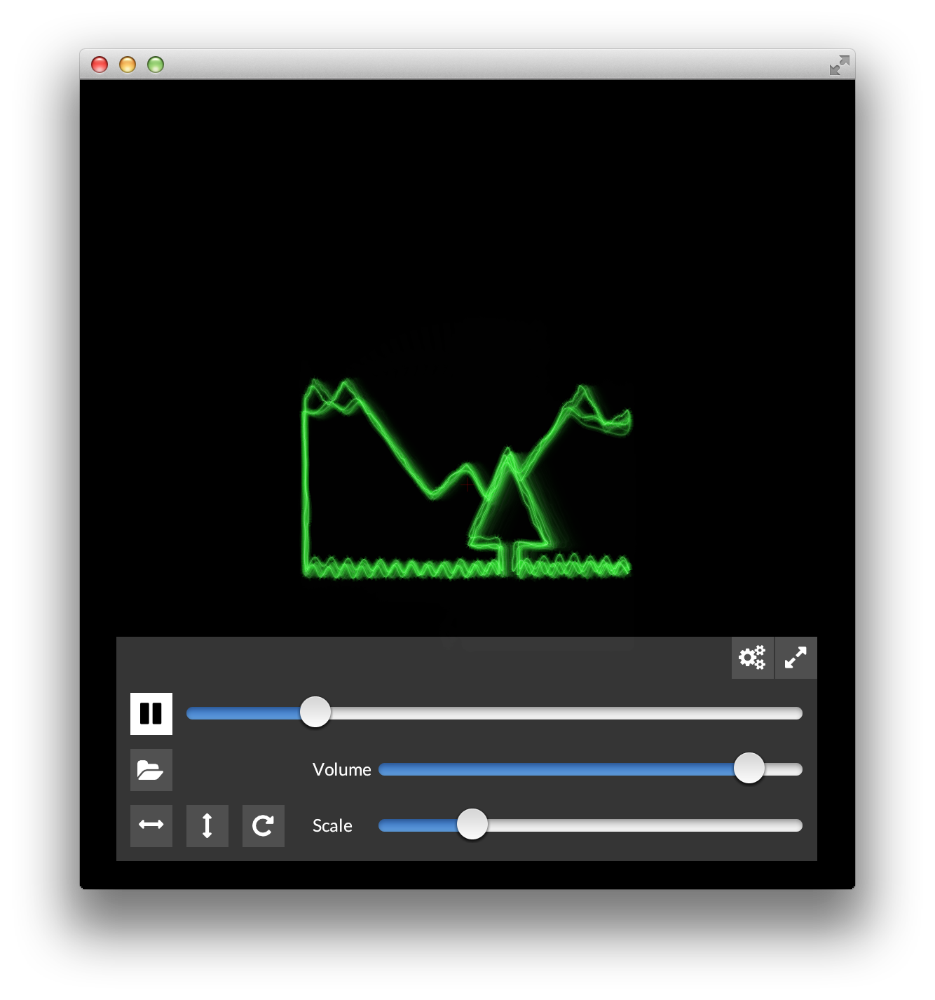

Oscilloscope
===

A software oscilloscope attempting to mimic the aesthetic of old school ray oscilloscopes. 
	

## Not a programmer? 

This is the programming documentation. If you are not a programmer please

* either visit the user page at <a href="http://asdfg.me/osci/">asdfg.me/osci/</a>
* or click on the [releases tab](https://github.com/kritzikratzi/Oscilloscope/releases) and download the latest version for your platform

# Project setup 

Things are moving around a bit at the moment. 
Make sure to read these instructions before each build. 

1. Download and unzip Openframeworks 0.9.3 or newer
1. Open the folder apps/myApps/
1. Clone the repository with submodules: `git clone --recursive https://github.com/kritzikratzi/Oscilloscope.git`
1. Download the binary release for ofxAvCodec from [https://github.com/kritzikratzi/ofxAvCodec/releases/tag/0.1](https://github.com/kritzikratzi/ofxAvCodec/releases/tag/0.1)
1. Replace the addons/ofxAvCodec/libs with the libs folder from the download

### Compiling with XCode (OSX10.10+)

1. (optional) run `scripts/clean.sh`
1. (optional) run `scripts/prepare.sh osx`
1. Open apps/myApps/oscilloscope/Oscilloscope.xcodeproject and then Build&Run
1. (Optional) Code sign by running `scripts/sign-mac.sh bin/Oscilloscope.app "Developer ID Application: Name of your certificate"` (run `security find-identity -v -p codesigning` to get a list of installed certs)

You can also build with `make && make run` on the command line. The resulting build will have no icon/no proper name/no retina support. 

### Compiling with Visual studio 2015

**VS Project file is not up to date, 

The shell commands can be run from a git bash, cygwin, msys, or any other shell emulator. 

1. run `scripts/clean.sh`
1. run `scripts/prepare.sh win32`
1. Open oscilloscope.sln and Build&Run

At this point audio should play through Asio (first choice), or Wasapi. You can follow these instructions to patch OF so you can pick at startup: http://pastebin.com/ZZLZ3jUm

### Compiling with make in Linux

1. run `scripts/clean.sh`
1. run `scripts/prepare.sh linux64`
1. run `make && make run` ? [subwolf knows, i haven't done this in ages!]

See scripts/readme.md for the full distribution process. 

### Package the software

* for osx run `scripts/dist.sh $platform $version`
* platform is one of `osx linux linux64 win32 win64`
* version is whatever version you want, e.g. `1.0.6`

## Experimenting with the shaders

Once you have a running version (either compiled or a binary release) you can manipulate the shaders on the fly. The shaders will be reloaded automatically when they're saved. Please note that you're bound to OpenGL2 / GLSL 1.2 (shader 120 with gl_ext_geometry_shader)

## License/Source code

* [Openframeworks](http://openframeworks.cc). A creative coding library. The larger part of it is licensed as MIT/BSD. 
* [FFmpeg](http://www.ffmpeg.org/) and [ofxAvCodec](https://github.com/kritzikratzi/ofxAvCodec). FFmpeg is _the_ encoder/decoder library and licensed under the gpl/lgpl 2.1. The binaries included here were compiled to comply with the lgpl. A copy of the LGPL together with instructions how the library was compiled for each platform can be found in the `legal` folder. 
* The sourcecode for this application is freely available on [github](https://github.com/kritzikratzi/Oscilloscope). 
